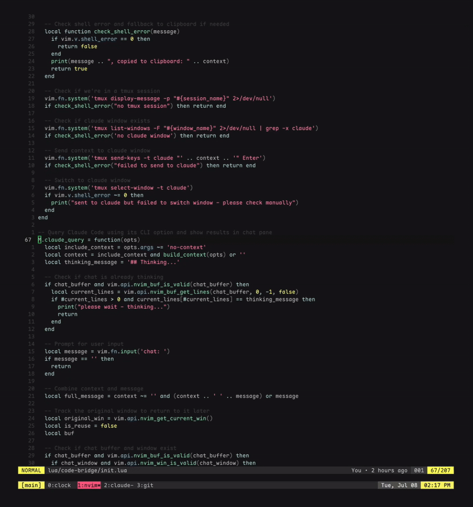

# code-bridge.nvim

A Neovim plugin that provides seamless integration between Neovim and Claude Code or other similar terminal
based coding agent like OpenCode, allowing you to send file context and queries directly to the agent from 
within your Neovim either via CLI or tmux. Messages can be sent to the agent in another tmux terminal or to
a chat buffer split within Neovim.

The goal of this plugin is not to provide the full IDE experience that Claude Code offers. This plugin
aims to make it easy to chat with claude code without running a terminal inside Neovim, and to interact
with a Claude Code session already running in agent mode in another terminal via tmux (or clipboard).




## Features

### Context Sharing

Send context information to the agent with support for current file, all open buffers, line ranges, git
diffs, or recently changed files. Context can be sent to the agent via the system clipboard or via tmux.
The tmux integration allows for flexible targeting via the window name or process search to find the pane
running the agent.

### Quick Chat

A quick chat interface to query the agent that splits open a persistent chat buffer. Allows for chatting with
the agent within Neovim. This is useful for quickly asking questions outside of the session running in the
agent or when there is no coding agent running. 

### Interactive Prompt Composer

Interactive prompts allow for composing the prompt within Neovim before sending to the agent. Multiple file
contexts can be easily added to the prompt along with information or questions and the prompt can be composed
with full vim editor support, before sending to the agent. Hide and resume the prompt composer as needed to
easily write detailed prompts.


## Requirements

- Neovim 0.7+
- Claude Code or Opencode installed and configured
- tmux (optional)


## Installation

### Using [lazy.nvim](https://github.com/folke/lazy.nvim)

```lua
{
  "samir-roy/code-bridge.nvim",
  config = function()
    require('code-bridge').setup()
  end
}
```

### Using [packer.nvim](https://github.com/wbthomason/packer.nvim)

```lua
use {
  "samir-roy/code-bridge.nvim",
  config = function()
    require('code-bridge').setup()
  end
}
```

### Manual Installation

Clone this repository to your Neovim configuration directory:
```bash
git clone https://github.com/samir-roy/code-bridge.nvim ~/.config/nvim/pack/plugins/start/code-bridge.nvim
```

Then add to your `init.lua`:
```lua
require('code-bridge').setup()
```


## Usage

The plugin provides various commands for different workflows:

### Basic File Context Commands

#### `:CodeBridgeTmux`
Send current file context to the agent via tmux. Works in normal and visual mode.

```vim
:CodeBridgeTmux
:'<,'>CodeBridgeTmux  " with visual selection
```

#### `:CodeBridgeTmuxAll`
Send all open buffers as context. In visual mode, includes your selection from current file plus all other buffers.

**Context Format:**
- Normal mode: `@filename.ext`
- Visual mode: `@filename.ext#L1-5`

### Advanced File Context Commands

#### `:CodeBridgeTmuxInteractive`
Edit the context prompt before sending. When using the popup editor:
- `<Ctrl-s>`: Send the prompt
- `<Leader-s>` in normal mode: Send the prompt
- `<Ctrl-x>`: Hide the prompt editor (can be resumed later)
- `<Leader-x>` in normal mode: Hide the prompt editor
- `<Ctrl-c>`: Cancel and close the prompt editor

#### `:CodeBridgeTmuxAllInteractive`
Edit all-buffers context prompt before sending.

#### `:CodeBridgeTmuxDiff`
Send current git changes (unstaged) to the agent.

#### `:CodeBridgeTmuxDiffStaged`
Send staged changes only to the agent.

#### `:CodeBridgeTmuxRecent`
Send recently modified files. In git repos: prioritizes pending changes + recent commits. Outside git: uses Vim's recent
files.

#### `:CodeBridgeTmuxRecentInteractive`
Edit recent files context before sending.

#### `:CodeBridgeTmuxDiagnostics`
Send diagnostics from the current buffer to the agent.

#### `:CodeBridgeTmuxDiagnosticsAll`
Send diagnostics from all buffers to the agent.

#### `:CodeBridgeTmuxDiagnosticsErrors`
Send only error-level diagnostics from the current buffer to the agent.

#### `:CodeBridgeTmuxDiagnosticsErrorsAll`
Send only error-level diagnostics from all buffers to the agent.

### Chat Interface Commands

#### `:CodeBridgeQuery`

Opens an interactive chat with the coding agent inside Neovim itself. A persistent markdown buffer for the conversation
is opened in a split pane. Your message along with the file context is sent to the agent and the response is
shown in the conversation buffer. Subsequent messages are part of the same chat thread as long as the chat pane
is kept open. Closing the pane clears the chat history.

#### `:CodeBridgeChat`

Similar to `:CodeBridgeQuery` but without file context - useful for general questions.

#### `:CodeBridgeHide`

Hides the chat buffer window without clearing the chat history. The chat buffer remains in memory and can be reopened
with the next query or with the show command.

#### `:CodeBridgeShow`

Shows the chat buffer window if it exists but is hidden.

#### `:CodeBridgeWipe`

Clears the chat history and closes the chat. This also cancels any running queries.

#### `:CodeBridgeCancelQuery`

Cancels any currently running query.

#### `:CodeBridgeResumePrompt`

Reopens a hidden prompt editor window, allowing you to continue editing a previously hidden prompt.

## Tmux Integration (Optional)

For optimal experience, set up a tmux session with a window named "claude":

```bash
# Create or attach to tmux session
tmux new-session -d -s coding

# Create claude window
tmux new-window -t coding -n claude

# Start Claude Code in the claude window
tmux send-keys -t coding:claude 'claude' Enter
```

The plugin will:
1. Check if you're in a tmux session
2. Find the claude target based on your configuration:
   - **window_name**: Look for a window named "claude"
   - **current_window**: Search for claude process in current window only
   - **find_process**: Search all panes across all windows for claude process
3. Send the context and optionally switch to the target
4. Fall back to clipboard if tmux is unavailable or target not found

## Key Bindings (Optional)

Add some or all of these to your configuration for quick access:

```lua
-- Basic tmux commands
vim.keymap.set("n", "<leader>ct", ":CodeBridgeTmux<CR>", { desc = "Send file to claude" })
vim.keymap.set("v", "<leader>ct", ":CodeBridgeTmux<CR>", { desc = "Send selection to claude" })
vim.keymap.set("n", "<leader>ca", ":CodeBridgeTmuxAll<CR>", { desc = "Send all buffers to claude" })

-- Advanced tmux commands
vim.keymap.set("n", "<leader>ci", ":CodeBridgeTmuxInteractive<CR>", { desc = "Interactive prompt to claude" })
vim.keymap.set("n", "<leader>cd", ":CodeBridgeTmuxDiff<CR>", { desc = "Send git diff to claude" })
vim.keymap.set("n", "<leader>cr", ":CodeBridgeTmuxRecent<CR>", { desc = "Send recent files to claude" })
vim.keymap.set("n", "<leader>ce", ":CodeBridgeTmuxDiagnostics<CR>", { desc = "Send diagnostics to claude" })

-- Chat interface
vim.keymap.set("n", "<leader>cq", ":CodeBridgeQuery<CR>", { desc = "Query claude with context" })
vim.keymap.set("v", "<leader>cq", ":CodeBridgeQuery<CR>", { desc = "Query claude with selection" })
vim.keymap.set("n", "<leader>cc", ":CodeBridgeChat<CR>", { desc = "Chat with claude" })
vim.keymap.set("n", "<leader>ch", ":CodeBridgeHide<CR>", { desc = "Hide chat window" })
vim.keymap.set("n", "<leader>cs", ":CodeBridgeShow<CR>", { desc = "Show chat window" })
vim.keymap.set("n", "<leader>cx", ":CodeBridgeWipe<CR>", { desc = "Wipe chat and clear history" })
vim.keymap.set("n", "<leader>ck", ":CodeBridgeCancelQuery<CR>", { desc = "Cancel running query" })
vim.keymap.set("n", "<leader>cp", ":CodeBridgeResumePrompt<CR>", { desc = "Resume hidden prompt" })
```

## Configuration

The plugin works out of the box with no configuration required, with the following defaults:

```
{
  tmux = {
    target_mode = 'window_name', -- 'window_name', 'current_window', 'find_process'
    window_name = 'claude',      -- window name to search for when target_mode = 'window_name'
    process_name = 'claude',     -- process name to search for when target_mode = 'current_window' or 'find_process'
    switch_to_target = true,     -- whether to switch to the target after sending
    find_node_process = false,   -- whether to look for node processes with matching name
  },
  interactive = {
    use_telescope = false,       -- whether to use telescope for prompt input (if available)
  },
  chat = {
    model = nil,                 -- llm model to use for queries and chat (nil = default)
    permission = nil,            -- permission flag for claude code only (nil = default or 'acceptEdits' = accept edits)
  },
}
```

### Tmux options

- `target_mode`: How to find claude (`'window_name'`, `'current_window'`, `'find_process'`) (default: `'window_name'`)
- `window_name`: Window name to search for when using `'window_name'` mode (default: `'claude'`)
- `process_name`: Process name to search for when using `'current_window'` or `'find_process'` mode (default: `'claude'`)
- `find_node_process`: Some agents like Claude Code run inside a node.js process so enabling this will look for the
  `'process_name'` in the command of node processes (default: `false`)
- `switch_to_target`: Whether to switch to the target after sending context (default: `true`)

### Interactive prompt options

- `use_telescope`: Use Telescope for interactive prompts when available (default: `false`)

### Quick chat options

- `model`: Specific LLM model to use for queries and chat (e.g. `'claude-haiku-4-5'`) (default: `nil`)
- `permission`: Permission flag for use with Claude Code only (`'acceptEdits'` or `nil`) (default: `nil`)

### Examples

The plugin can be configured with various tmux targeting modes:

**`'window_name'` (default)**: Search for a tmux window by name
```lua
require('code-bridge').setup({
  tmux = {
    target_mode = 'window_name',
    window_name = 'claude',  -- window name to search for
  },
})
```

**`'current_window'`**: Search for pane with claude process in the current tmux window
```lua
require('code-bridge').setup({
  tmux = {
    target_mode = 'current_window',
    process_name = 'claude',
    switch_to_target = false,  -- don't switch to claude pane after sending
    find_node_process = true, -- agent runs inside node.js process
  }
})
```

**`'find_process'`**: Find any tmux pane running a opencode process
```lua
require('code-bridge').setup({
  tmux = {
    target_mode = 'find_process',
    process_name = 'opencode',  -- process name to search for
    switch_to_target = true,  -- switch to opencode pane after sending
  }
})
```

## Example Workflows

### Quick Chat Workflow
1. Open a file in Neovim
2. Select some lines in visual mode
3. Run `:CodeBridgeQuery`
4. Type your question about the selected code
5. View Claude's response in the chat buffer
6. Continue the conversation with follow-up queries

### Code Review Workflow
1. Make changes to your code
2. Run `:CodeBridgeTmuxDiff` to send git changes to Claude
3. Claude analyzes your changes and provides feedback

### Multi-file Analysis
1. Open several related files in Neovim
2. Select important code in current file (visual mode)
3. Run `:CodeBridgeTmuxAllInteractive`
4. Add question like "How do these components work together?"
5. Claude gets context from all files plus your selection

### Recent Work Context
1. Working on a project over time
2. Run `:CodeBridgeTmuxRecent` to send recent changes
3. Ask your question like "Summarize recent changes"

## Command Context Summary

| Command | Purpose | Context |
|---------|---------|----------|
| `:CodeBridgeTmux` | Basic file sending | Current file/selection |
| `:CodeBridgeTmuxAll` | Multi-file analysis | All open buffers |
| `:CodeBridgeTmuxInteractive` | Edit prompt first | Current file + your question |
| `:CodeBridgeTmuxAllInteractive` | Edit multi-file prompt | All buffers + your question |
| `:CodeBridgeTmuxDiff` | Code review | Git changes (unstaged) |
| `:CodeBridgeTmuxDiffStaged` | Staged review | Git changes (staged) |
| `:CodeBridgeTmuxRecent` | Recent context | Recent files + pending changes |
| `:CodeBridgeTmuxRecentInteractive` | Edit recent context | Recent files + your question |
| `:CodeBridgeTmuxDiagnostics` | Send diagnostics | Current buffer diagnostics |
| `:CodeBridgeTmuxDiagnosticsAll` | Send all diagnostics | All buffers diagnostics |
| `:CodeBridgeTmuxDiagnosticsErrors` | Send errors | Current buffer errors only |
| `:CodeBridgeTmuxDiagnosticsErrorsAll` | Send all errors | All buffers errors only |
| `:CodeBridgeQuery` | Quick chat | File context + chat history |
| `:CodeBridgeChat` | Quick chat | Chat history only |
| `:CodeBridgeResumePrompt` | Resume hidden prompt | Previously edited context |

## License

Licensed under the GNU General Public License v2.0. See [LICENSE](LICENSE) for details.

## Contributing

Issues and pull requests are welcome! Please ensure your contributions align with the project's goals
of providing a Neovim-Claude integration that does not open a terminal inside Neovim and continue
using existing Claude Code session in another terminal.
